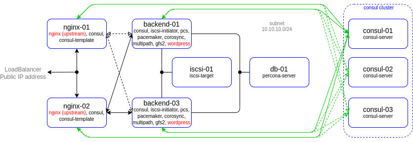
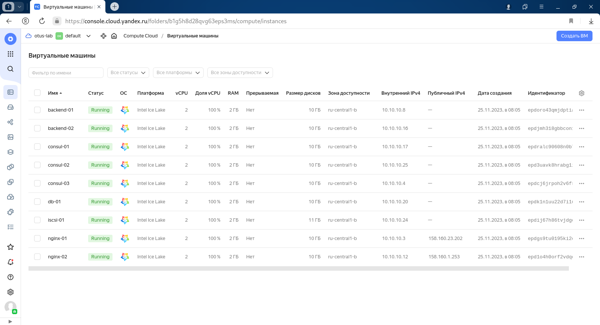
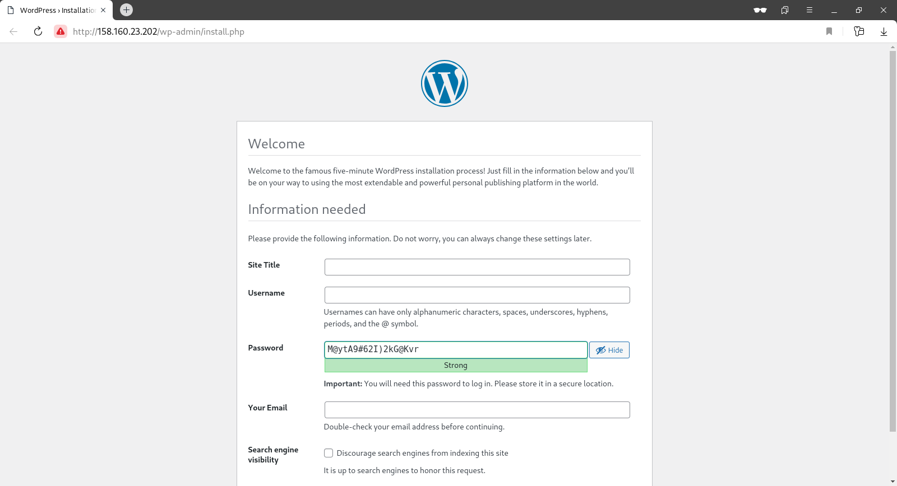
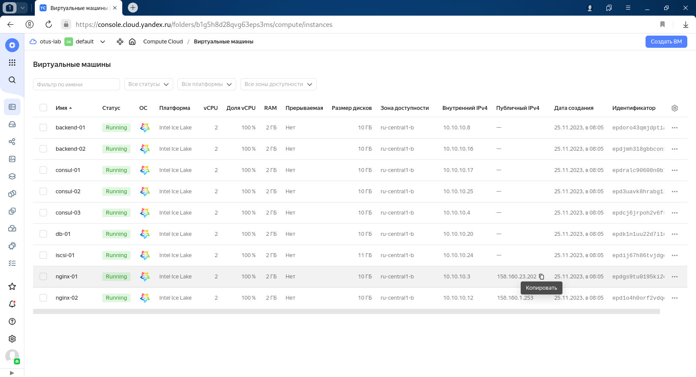

# lab-09
otus | consul

### Домашнее задание
Consul cluster для service discovery и DNS

#### Цель:
Реализовать consul cluster который выдает доменное имя для веб портала с прошлой ДЗ.
Плавающий IP заменить на балансировку через DNS.
В случае умирание одного из веб серверов IP должен убираться из DNS.

#### Критерии оценки:
Статус "Принято" ставится при выполнении перечисленных требований.


### Выполнение домашнего задания

#### Создание стенда

Стенд будем разворачивать с помощью Terraform на YandexCloud, настройку серверов будем выполнять с помощью Ansible.

Необходимые файлы размещены в репозитории GitHub по ссылке:
```
https://github.com/SergSha/lab-09.git
```

Схема:



Для начала получаем OAUTH токен:
```
https://cloud.yandex.ru/docs/iam/concepts/authorization/oauth-token
```

Настраиваем аутентификации в консоли:
```
export YC_TOKEN=$(yc iam create-token)
export TF_VAR_yc_token=$YC_TOKEN
```

Скачиваем проект с гитхаба:
```
git clone https://github.com/SergSha/lab-09.git && cd ./lab-09
```

В файле provider.tf нужно вставить свой 'cloud_id':
```
cloud_id  = "..."
```

При необходимости в файле main.tf вставить нужные 'ssh_public_key' и 'ssh_private_key', так как по умолчанию соответсвенно id_rsa.pub и id_rsa:
```
ssh_public_key  = "~/.ssh/id_rsa.pub"
ssh_private_key = "~/.ssh/id_rsa"
```

Для того чтобы развернуть стенд, нужно выполнить следующую команду, вставляя свои значения (пароли) для переменных admin_password, kibanaserver_password, logstash_password:
```
terraform init && terraform apply -auto-approve && \
sleep 60 && ansible-playbook ./provision.yml \
--extra-vars "admin_password=admin@Otus1234 \
kibanaserver_password=kibana@Otus1234 \
logstash_password=logstash@Otus1234"
```

По завершению команды получим данные outputs:
```
Outputs:

backend-servers-info = {
  "backend-01" = {
    "ip_address" = tolist([
      "10.10.10.33",
    ])
    "nat_ip_address" = tolist([
      "",
    ])
  }
  "backend-02" = {
    "ip_address" = tolist([
      "10.10.10.15",
    ])
    "nat_ip_address" = tolist([
      "",
    ])
  }
}
db-servers-info = {
  "db-01" = {
    "ip_address" = tolist([
      "10.10.10.8",
    ])
    "nat_ip_address" = tolist([
      "",
    ])
  }
}
iscsi-servers-info = {
  "iscsi-01" = {
    "ip_address" = tolist([
      "10.10.10.12",
    ])
    "nat_ip_address" = tolist([
      "",
    ])
  }
}
jump-servers-info = {
  "jump-01" = {
    "ip_address" = tolist([
      "10.10.10.11",
    ])
    "nat_ip_address" = tolist([
      "158.160.18.186",
    ])
  }
}
kafka-servers-info = {
  "kafka-01" = {
    "ip_address" = tolist([
      "10.10.10.14",
    ])
    "nat_ip_address" = tolist([
      "",
    ])
  }
  "kafka-02" = {
    "ip_address" = tolist([
      "10.10.10.39",
    ])
    "nat_ip_address" = tolist([
      "",
    ])
  }
  "kafka-03" = {
    "ip_address" = tolist([
      "10.10.10.7",
    ])
    "nat_ip_address" = tolist([
      "",
    ])
  }
}
loadbalancer-info = [
  {
    "attached_target_group" = toset([
      {
        "healthcheck" = tolist([
          {
            "healthy_threshold" = 2
            "http_options" = tolist([])
            "interval" = 2
            "name" = "tcp"
            "tcp_options" = tolist([
              {
                "port" = 5601
              },
            ])
            "timeout" = 1
            "unhealthy_threshold" = 2
          },
        ])
        "target_group_id" = "enppp6g1latmjss54dbd"
      },
      {
        "healthcheck" = tolist([
          {
            "healthy_threshold" = 2
            "http_options" = tolist([])
            "interval" = 2
            "name" = "tcp"
            "tcp_options" = tolist([
              {
                "port" = 80
              },
            ])
            "timeout" = 1
            "unhealthy_threshold" = 2
          },
        ])
        "target_group_id" = "enp3lvvkha1esom278nf"
      },
    ])
    "created_at" = "2023-11-20T08:23:36Z"
    "deletion_protection" = false
    "description" = ""
    "folder_id" = "b1g5h8d28qvg63eps3ms"
    "id" = "enpnpgch9h4pl3kp0e5a"
    "labels" = tomap({})
    "listener" = toset([
      {
        "external_address_spec" = toset([
          {
            "address" = "158.160.130.226"
            "ip_version" = "ipv4"
          },
        ])
        "internal_address_spec" = toset([])
        "name" = "dashboards-listener"
        "port" = 5601
        "protocol" = "tcp"
        "target_port" = 5601
      },
      {
        "external_address_spec" = toset([, будем собирать логи работы nginx , а с серверов хранения баз данных - логи mysql
          {
            "address" = "158.160.130.226"
            "ip_version" = "ipv4"
          },
        ])
        "internal_address_spec" = toset([])
        "name" = "webservers-listener"
        "port" = 80
        "protocol" = "tcp"
        "target_port" = 80
      },
    ])
    "name" = "mylb"
    "network_load_balancer_id" = "enpnpgch9h4pl3kp0e5a"
    "region_id" = "ru-central1"
    "type" = "external"
  },
]
nginx-servers-info = {
  "nginx-01" = {
    "ip_address" = tolist([
      "10.10.10.5",
    ])
    "nat_ip_address" = tolist([
      "",
    ])
  }
  "nginx-02" = {
    "ip_address" = tolist([
      "10.10.10.34",
    ])
    "nat_ip_address" = tolist([
      "",
    ])
  }
}
os-servers-info = {
  "os-01" = {
    "ip_address" = tolist([
      "10.10.10.9",
    ])
    "nat_ip_address" = tolist([
      "",
    ])
  }
}
```

На всех серверах будут установлены ОС Almalinux 8, настроены смнхронизация времени Chrony, система принудительного контроля доступа SELinux, в качестве firewall будет использоваться NFTables.

Стенд был взят из лабораторной работы 7 https://github.com/SergSha/lab-07. Кафку развернём на кластере из трёх нод kafka-01, kafka-02, kafka-03. Координатором в целях выбора лидера в кластере kafka будет осущетсвляться ZooKeeper.

Для централизованного сбора логов со всех серверов данного стенда создадим воспользуемся OpenSearch, установленный и настроенный на сервере os-01. 
В нашем проекте kafka будет собирать логи с балансировщиков (nginx-01 и nginx-02) и бэкендов (backend-01 и backend-02), где будут установлены WordPress, хранить у себя и будет передавать эти логи OpenSearch через Logstash на сервере os-01.

Для визуализации данных логов будем использовать OpenSearch Dashboard. В данном стенде OpenSearch Dashboard для удобства будем устанавливать на сервер Jump-01.

Для установки OpenSearch и OpenSearch Dashboard был склонирован из репозитория https://github.com/opensearch-project/ansible-playbook с внесением небольших изменений под свой проект.

В качестве агентов на серверах, откуда будем собирать логи, будем использовать FileBeat.

Так как на YandexCloud ограничено количество выделяемых публичных IP адресов, в дополнение к этому стенду создадим ещё один сервер jump-01 в качестве JumpHost, через который будем подключаться по SSH (в частности для Ansible) к другим серверам той же подсети.

Список виртуальных машин после запуска стенда:



Для проверки работы стенда воспользуемся установленным на бэкендах Wordpress:



Значение IP адреса сайта получен от балансировщика от YandexCloud:



Страница OpenSearch Dashboard открывается в браузере, вводя в адресную строку публичный IP адрес балансировщика от YandexCloud с портом 5601:
```
158.160.130.226:5601
```


Вводим логин и пароль и кликаем по кнопке "Log In":


Стартовая страница:


[root@nginx-01 ~]# consul members
Node        Address           Status  Type    Build   Protocol  DC   Partition  Segment
consul-01   10.10.10.25:8301  alive   server  1.17.0  2         dc1  default    <all>
consul-02   10.10.10.9:8301   alive   server  1.17.0  2         dc1  default    <all>
consul-03   10.10.10.11:8301  alive   server  1.17.0  2         dc1  default    <all>
backend-01  10.10.10.19:8301  alive   client  1.17.0  2         dc1  default    <default>
backend-02  10.10.10.12:8301  alive   client  1.17.0  2         dc1  default    <default>
nginx-01    10.10.10.13:8301  alive   client  1.17.0  2         dc1  default    <default>
nginx-02    10.10.10.23:8301  alive   client  1.17.0  2         dc1  default    <default>
[root@nginx-01 ~]#


